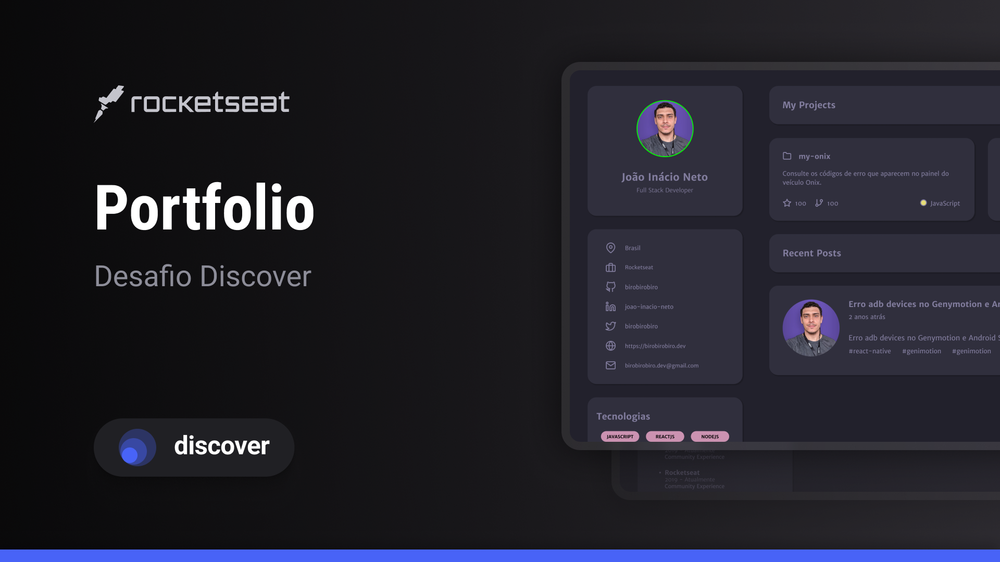

<h1 align="center"> Portfólio </h1>

  <a href="#-tecnologias">Tecnologias</a>&nbsp;&nbsp;&nbsp;|&nbsp;&nbsp;&nbsp;
  <a href="#-projeto">Projeto</a>&nbsp;&nbsp;&nbsp;|&nbsp;&nbsp;&nbsp;
  <a href="#-layout">Layout</a>&nbsp;&nbsp;&nbsp;

 

  

## 🚀 Tecnologias

Esse projeto foi desenvolvido com as seguintes tecnologias:

- HTML e CSS
- JavaScript
- Git e Github
- Figma

## 💻 Projeto

Um portfólio é uma coleção organizada de trabalhos, projetos ou amostras que representam as habilidades e conquistas de uma pessoa, empresa ou organização em um campo específico. Ele é usado para demonstrar a qualidade e diversidade do trabalho em contextos profissionais, como entrevistas de emprego ou avaliações de desempenho.

- [Acesse o projeto finalizado, online](https://oldrado-jr.github.io/portfolio)

## 🔖 Layout

Você pode visualizar o layout do projeto através [DESSE LINK](https://www.figma.com/community/file/1241120452628556396). É necessário ter conta no [Figma](https://figma.com) para acessá-lo.
